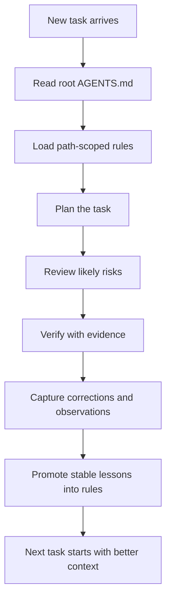

# Codex Evolve

> The operating scaffold that turns Codex into a correction-compounding engineering system.


This is not another prompt pack.

This repository is a minimal operating scaffold for teams who want Codex to stop repeating the same mistakes and start accumulating engineering judgment over time.

Instead of relying on one-off conversations, this system turns each correction into reusable project assets:

- a root constitution
- path-scoped rules
- role-separated agents
- an append-only memory loop

## Why This Exists

Most Codex workflows are session-bound.

You correct a mistake, the task gets fixed, and the lesson disappears with the conversation. A week later, the same class of mistake shows up again.

The problem is usually not the model alone. The problem is that the surrounding engineering system has no durable place to store:

- what was corrected
- why it failed
- how it was verified
- when it deserves to become a rule

This repository provides that missing structure.

## The Four Layers

### 1. Cognitive Core

The root `AGENTS.md` acts like the system constitution.

It defines:

- mission
- boundaries
- done criteria
- operating order
- rule upgrade protocol

### 2. Path-Scoped Rules

Rules are loaded by path and scenario, not blasted into every session equally.

That keeps context tighter and makes constraints feel relevant instead of noisy.

### 3. Role Separation

Planning, review, verification, and memory capture are treated as separate jobs.

You can run them as real subagents or emulate the same order in one thread:

- planner
- reviewer
- verifier
- collector

### 4. Memory Loop

Corrections become observations.
Observations become learned rules.
Learned rules reshape future execution.

That is where the compounding effect comes from.

## How It Works



## Repository Structure

```text
codex-evolve/
  AGENTS.md
  README.md
  agents/
    README.md
    planner.md
    reviewer.md
    verifier.md
    collector.md
  rules/
    README.md
    path-risk-matrix.md
    trigger-map.md
  skills/
    retro-capture.md
  memory/
    README.md
    corrections.jsonl
    observations.jsonl
    learned-rules.md
    evolution-log.md
  docs/
    AGENTS.md
```

## Quick Start

1. Copy this scaffold into the root of a long-lived project.
2. Edit `AGENTS.md` so the mission and done criteria match your team.
3. Add path-local `AGENTS.md` files where a subdirectory has special risk.
4. After non-trivial tasks, append entries to `memory/corrections.jsonl` and `memory/observations.jsonl`.
5. Promote repeated lessons into `memory/learned-rules.md`.
6. Record system-level changes in `memory/evolution-log.md`.

## What You Get

- Fewer repeated low-level mistakes
- Clearer handoff between planning, implementation, and review
- Better reuse of lessons across sessions
- A migration path from manual discipline to hook-based automation

## Best Fit

This scaffold shines when you are in one of these situations:

- long-running projects
- repeated bug-fix loops
- multi-role collaboration
- frequent human corrections
- a desire to make AI work more stable over time

If you only need quick one-off generation, this is probably too much structure.

## Design Principles

- Keep rules local before making them global.
- Promote from evidence, not vibes.
- Preserve failed attempts in memory instead of hiding them.
- Separate planning, review, verification, and memory capture.
- Favor small, durable process upgrades over large speculative systems.

## Roadmap

- Hook-driven automatic capture
- Path-aware rule loading in host runtimes
- Memory summarization utilities
- Promotion tooling for observations -> rules
- Starter variants for solo builders and teams

## Core Claim

The model does not become self-evolving on its own.

The engineering system does.

Once the system can remember corrections, validate stable rules, and feed those lessons back into the next task, Codex stops being just a generator and starts becoming an improving workflow.
