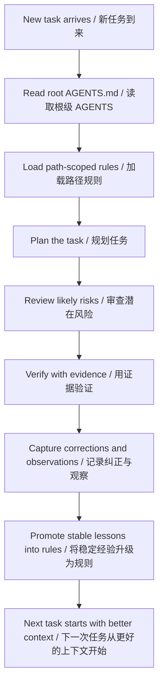

# Codex Evolve

> Turn Codex into a correction-compounding engineering system.  
> 让 Codex 从“会生成代码”变成“会积累经验的工程系统”。


This is not another prompt pack.  
这不是另一个 prompt 模板合集。

Codex Evolve is a minimal scaffold for teams who want Codex to remember corrections, promote stable rules, and improve workflow quality over time.  
Codex Evolve 是一套最小可运行骨架，用来让 Codex 记住纠正、沉淀规则，并随着项目推进持续变稳。

Instead of letting lessons disappear with each session, this system turns every useful correction into reusable engineering assets:

- a root constitution
- path-scoped rules
- role-separated agents
- an append-only memory loop

它不会让经验随着会话结束而消失，而是把每一次有价值的纠正沉淀成可复用的工程资产：

- 根级宪法
- 路径作用域规则
- 角色分工
- 追加式记忆闭环

## Why It Matters | 为什么需要它

Most Codex workflows are session-bound: a mistake gets corrected, the task gets finished, and the lesson disappears.  
大多数 Codex 工作流都被困在单次会话里：错误被纠正了，任务完成了，但经验也随之消失。

A week later, the same class of mistake often comes back.  
一周之后，同类错误又会再次出现。

The issue is often not just the model. The issue is that the surrounding engineering system has no durable place to store:

- what was corrected
- why it failed
- how it was verified
- when it deserves to become a rule

问题往往不只是模型本身，而是外部工程系统没有地方长期保存这些关键经验：

- 改正了什么
- 为什么会失败
- 最终如何验证
- 什么时候值得升级成规则

## Core Claim | 核心主张

The model does not become self-evolving on its own.  
模型本身不会自动自进化。

The engineering system does.  
真正发生进化的是围绕模型搭建的工程系统。

Once the system can remember corrections, validate stable rules, and feed those lessons back into the next task, Codex stops being just a generator and starts becoming an improving workflow.  
一旦系统能够记住纠正、验证稳定规则，并把这些经验反馈到下一次任务中，Codex 就不再只是一个生成器，而会变成一个越来越稳的工作流。

## The Four Layers | 四层架构

### 1. Cognitive Core | 认知核心

The root `AGENTS.md` acts like the system constitution. It defines mission, boundaries, done criteria, operating order, and rule upgrade protocol.  
根目录的 `AGENTS.md` 就像系统宪法，定义目标、边界、完成标准、执行顺序，以及规则升级协议。

### 2. Path-Scoped Rules | 路径作用域规则

Rules are loaded by path and scenario, not blasted equally into every session. This keeps context tighter and constraints more relevant.  
规则按路径和场景加载，而不是全局灌输到每一次会话里，这能让上下文更聚焦、约束更贴近实际。

### 3. Role Separation | 角色分工

Planning, review, verification, and memory capture are treated as separate jobs. You can run them as real subagents or emulate the same order in one thread.  
规划、审查、验证和记忆采集被视为不同职责。你既可以把它们做成真实 subagent，也可以在单线程里按同样顺序执行。

### 4. Memory Loop | 记忆闭环

Corrections become observations. Observations become learned rules. Learned rules reshape future execution.  
纠正沉淀为观察，观察升级为规则，规则再反过来塑造下一次执行。

That is where the compounding effect comes from.  
这就是“经验复利”真正发生的地方。

## How It Works | 工作方式



## Repository Structure | 仓库结构

```text
codex-evolve/
  AGENTS.md
  README.md
  agents/
    README.md
    planner.md
    reviewer.md
    verifier.md
    collector.md
  rules/
    README.md
    path-risk-matrix.md
    trigger-map.md
  skills/
    retro-capture.md
  memory/
    README.md
    corrections.jsonl
    observations.jsonl
    learned-rules.md
    evolution-log.md
  docs/
    AGENTS.md
    social-launch.md
```

## Quick Start | 快速开始

1. Copy this scaffold into the root of a long-lived project.  
   把这套骨架复制到一个长期项目的根目录。
2. Edit `AGENTS.md` so the mission and done criteria match your team.  
   修改 `AGENTS.md`，让目标和完成标准贴合你的团队。
3. Add path-local `AGENTS.md` files where a subdirectory has special risk.  
   对高风险子目录补充局部 `AGENTS.md`。
4. After non-trivial tasks, append entries to `memory/corrections.jsonl` and `memory/observations.jsonl`.  
   每次非 trivial 任务结束后，向 `memory/corrections.jsonl` 和 `memory/observations.jsonl` 追加记录。
5. Promote repeated lessons into `memory/learned-rules.md`.  
   把反复出现的经验升级到 `memory/learned-rules.md`。
6. Record system-level changes in `memory/evolution-log.md`.  
   把系统层面的变化写进 `memory/evolution-log.md`。

## What You Get | 你会得到什么

- Fewer repeated low-level mistakes  
  更少重复出现的低级错误
- Clearer handoff between planning, implementation, and review  
  更清晰的规划、实现与审查分工
- Better reuse of lessons across sessions  
  更高效的跨会话经验复用
- A migration path from manual discipline to hook-based automation  
  一条从手工约束走向 Hook 自动化的升级路径

## Best Fit | 最适合的场景

This scaffold works especially well for:

- long-running projects
- repeated bug-fix loops
- multi-role collaboration
- frequent human corrections
- teams that want AI workflows to become more stable over time

这套骨架尤其适合以下场景：

- 长期项目
- 反复修 bug 的迭代过程
- 多角色协作
- 高频人工纠错
- 希望 AI 工作流越用越稳的团队

If you only need one-off generation, this is probably too much structure.  
如果你只需要一次性生成内容，这套结构可能会显得偏重。

## Design Principles | 设计原则

- Keep rules local before making them global.  
  先局部约束，再全局推广。
- Promote from evidence, not vibes.  
  规则升级基于证据，而不是感觉。
- Preserve failed attempts in memory instead of hiding them.  
  失败尝试也要保留在记忆里，而不是被抹掉。
- Separate planning, review, verification, and memory capture.  
  明确分离规划、审查、验证和记忆采集。
- Favor small, durable process upgrades over large speculative systems.  
  优先选择小而稳的流程升级，而不是庞大但空转的系统设计。

## Roadmap | 路线图

- Hook-driven automatic capture  
  用 Hook 自动采集纠正和观察
- Path-aware rule loading in host runtimes  
  在宿主运行时中实现路径感知的规则加载
- Memory summarization utilities  
  记忆摘要与整理工具
- Promotion tooling for observations -> rules  
  从 observation 自动升级到 rule 的辅助工具
- Starter variants for solo builders and teams  
  面向个人与团队的不同 starter 版本

## One-Line Summary | 一句话总结

Codex Evolve helps Codex stop forgetting.  
Codex Evolve 让 Codex 不再轻易遗忘。
